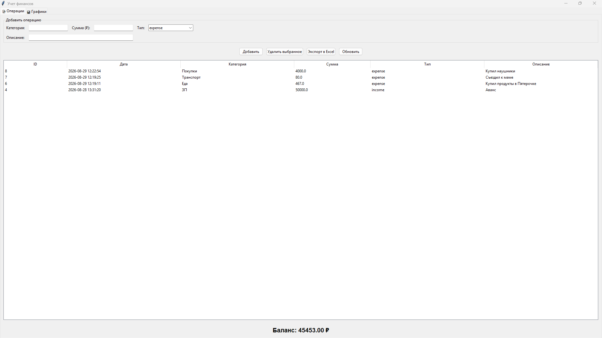
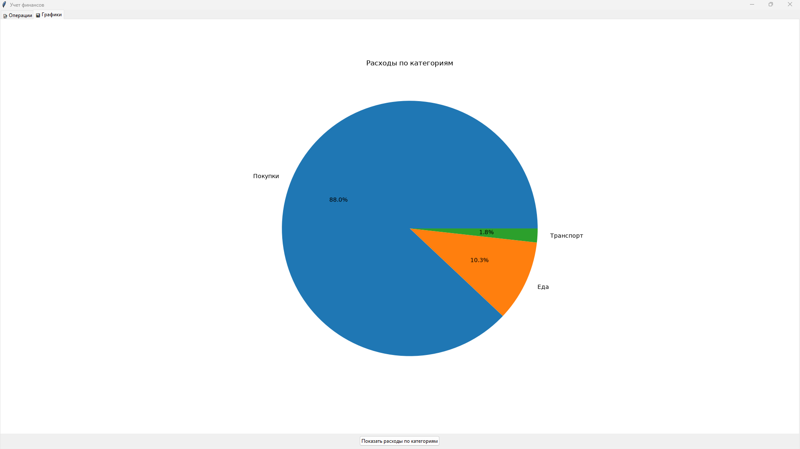

# 💰 Finance Tracker (Учет финансов)

Десктопное приложение на Python для учета личных доходов и расходов. 
Проект демонстрирует работу с базами данных (SQLite), интерфейсом (Tkinter) и визуализацией данных (Matplotlib).

## 📸 Скриншоты
## 📸 Скриншоты



## 🚀 Функционал
- Добавление доходов и расходов.
- Удаление операций.
- Решение баланса автоматически.
- Выгрузка данных в Excel (формат .xlsx).
- Круговая диаграмма для визуализации расходов по категориям.
- Хранение данных в локальной базе SQLite.

## 🛠️ Технологии
- Python 3.10+
- Tkinter (GUI)
- SQLite (База данных)
- Matplotlib (Графики)
- Pandas (Экспорт в Excel)

## 📦 Установка и запуск
1. Склонируй репозиторий:
   ```bash
   git clone https://github.com/abc13666/finance-tracker.git
